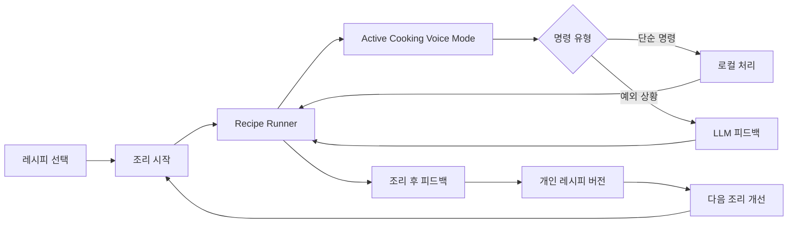
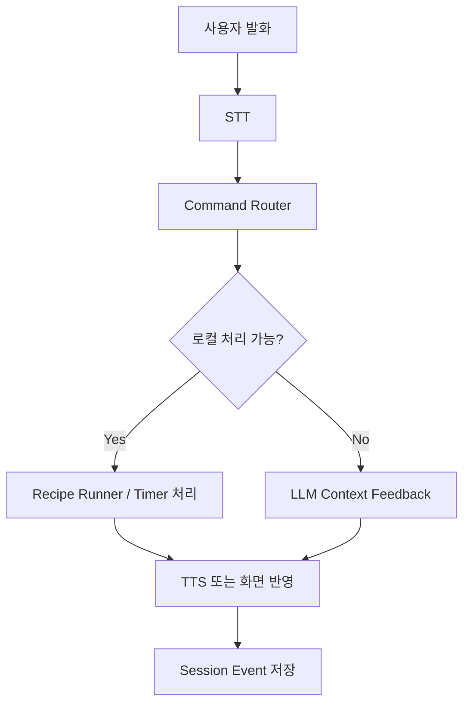

# 09. CookPilot 확정 MVP 설계서

작성 기준: 2026-07-10 팀 논의 및 MVP 범위 확정  
목표 일정: 2026-07-26까지 동작 가능한 앱 데모  
대상 서비스: CookPilot - 조리 화면에서만 동작하는 음성 기반 실시간 AI 조리 코치

## 1. 확정 MVP 한 문장

CookPilot MVP는 조리 화면이 활성화된 동안에만 STT/TTS 기반 음성 조리 모드를 켜고, 레시피 단계를 자동 진행하며, 단순 명령은 로컬에서 처리하고, 예외 상황은 LLM이 현재 조리 단계 맥락으로 피드백한다. 조리 후 피드백은 개인 레시피 버전에 반영되어 다음 조리 때 개선된 레시피로 제공된다.

이 MVP의 핵심은 "AI 레시피 검색"이 아니라 "조리 중 음성 피드백 -> 조리 후 피드백 -> 개인 레시피 업데이트 -> 다음 조리 개선"으로 이어지는 반복 개인화 루프다.

## 2. 제품 정의

### 2.1 제품 포지셔닝

CookPilot은 요리 초보자가 레시피를 보며 실제 조리할 때 겪는 타이밍, 단계 진행, 예외 상황 판단, 결과 개선 문제를 해결하는 실시간 조리 코치 앱이다.

사용자는 요리 중 손이 젖거나 재료를 만지고 있어 화면 조작이 어렵다. CookPilot은 조리 화면에서 현재 단계를 계속 보여주고, 필요한 안내는 TTS로 읽어주며, 사용자가 음성으로 말하면 STT로 인식해 명령 또는 질문을 처리한다.

### 2.2 핵심 차별점

| 구분 | 기존 레시피 서비스 | CookPilot MVP |
|---|---|---|
| 중심 경험 | 조리 전 레시피 탐색 | 조리 중 실시간 진행과 피드백 |
| 입력 방식 | 화면 터치, 검색, 영상 시청 | 조리 화면 기반 음성 명령과 화면 확인 |
| AI 사용 | 레시피 생성/검색 보조 | 현재 단계 맥락 기반 예외 상황 피드백 |
| 개인화 | 즐겨찾기 또는 추천 | 조리 후 피드백을 반영한 내 버전 레시피 |
| 반복 사용 이유 | 다시 검색 | 내 레시피가 앱에 누적되어 다음 조리가 개선됨 |

## 3. 확정된 핵심 루프

```text
레시피 선택
-> 조리 시작
-> 현재 단계 표시 + TTS 안내
-> 단계별 타이머 자동 진행
-> 조리 중 STT 음성 명령 수신
-> 단순 명령은 로컬 처리
-> 예외 상황은 LLM 피드백
-> 조리 후 피드백 입력
-> 개인 레시피 버전 업데이트
-> 다음 조리 때 개인화 버전 제공
```



## 4. MVP 범위

### 4.1 포함 범위

| ID | 기능 | 설명 |
|---|---|---|
| P0-01 | 레시피 선택 | MVP용 제한된 레시피 중 하나를 선택한다. |
| P0-02 | 조리 시작 | 선택한 레시피로 조리 세션을 생성한다. |
| P0-03 | 현재 단계 표시 | 조리 화면에 현재 단계 조리법, 시간, 주의사항을 계속 보여준다. |
| P0-04 | TTS 단계 안내 | 단계 시작 시 현재 조리법을 음성으로 읽어준다. |
| P0-05 | 단계별 타이머 자동 진행 | 단계에 시간이 있으면 안내 후 자동으로 타이머를 시작한다. |
| P0-06 | STT 음성 명령 | 조리 화면에서 유저 발화를 텍스트로 변환한다. |
| P0-07 | 로컬 명령 처리 | 다음, 이전, 반복, 타이머 연장 등은 LLM 없이 처리한다. |
| P0-08 | LLM 예외 피드백 | 물이 안 끓음, 너무 짬, 덜 익음, 재료 없음 등 판단이 필요한 발화를 처리한다. |
| P0-09 | 조리 후 피드백 | 만족도, 짰다/싱거웠다/덜 익었다 등 결과 피드백을 입력한다. |
| P0-10 | 개인 레시피 버전 업데이트 | 조리 중 이벤트와 조리 후 피드백을 반영해 내 버전 레시피를 만든다. |
| P0-11 | 다음 조리 개인화 | 같은 레시피 재진입 시 개선된 개인 버전을 제공한다. |

### 4.2 제외 범위

| 기능 | 제외 이유 |
|---|---|
| 인기 레시피 | MVP 핵심 루프 검증과 직접 관련이 낮다. |
| 추천 알고리즘 고도화 | 개인 레시피 루프 검증 후 확장한다. |
| 남의 버전 추천 | 개인화 루프가 먼저 검증되어야 한다. |
| 사진 기반 익힘/농도 판정 | 구현 리스크가 높고 안전 판단 부담이 크다. |
| 커뮤니티 | 조리 중 코칭과 개인화 검증 이후 기능이다. |
| 장보기/냉장고 연동 | 레시피 실행 경험과 별도 도메인이다. |
| 백그라운드 음성 호출 | OS 제약, 배터리, 권한 리스크가 크다. |
| 커스텀 호출어 | Siri/Bixby 수준의 OS 레벨 기능이 필요하다. |
| 대규모 레시피 DB | MVP에서는 제한된 메뉴로 깊게 검증한다. |

## 5. 음성 동작 원칙

### 5.1 Active Cooking Voice Mode

CookPilot의 음성 수신은 앱 전체에서 항상 켜지는 기능이 아니다. 음성은 active cooking session에서만 활성화된다.

```text
앱 실행
-> 레시피 선택
-> 조리 시작
-> 조리 화면 진입
-> 음성 조리 모드 ON
-> 조리 중 음성 명령 수신
-> 조리 완료/중단/화면 이탈
-> 음성 조리 모드 OFF
```

### 5.2 수신 범위

| 항목 | 결정 |
|---|---|
| 조리 화면 포그라운드 | 지원 |
| 조리 세션 중 음성 명령 | 지원 |
| 화면에 현재 단계 표시 | 항상 유지 |
| 화면 이탈 시 음성 수신 | 중단 |
| 조리 완료/중단 시 음성 수신 | 중단 |
| 백그라운드 음성 수신 | 미지원 |
| 잠금화면 음성 수신 | 미지원 |
| "쿡파일럿아" 호출어 | 미지원 |
| 백그라운드 타이머 알림 | 추후 또는 제한 지원 |

### 5.3 STT/TTS 정의

| 구성 | 역할 | MVP 방향 |
|---|---|---|
| STT | 사용자 음성을 텍스트로 변환 | 조리 화면에서 유저 명령/질문 인식 |
| TTS | 텍스트 안내를 음성으로 출력 | 단계 안내, 타이머 종료 안내, LLM 피드백 읽기 |
| LLM | 조리 맥락 기반 판단 | 예외 상황과 개인화 반영에만 사용 |

MVP에서 STT/TTS는 필수 범위에 포함한다. 다만 "항상 대화하는 AI"가 아니라 "조리 세션 중 제한적으로 동작하는 음성 입출력"으로 구현한다.

## 6. 라면 예시 시나리오

### 6.1 정상 진행

```text
1. 사용자가 라면 레시피를 선택한다.
2. 사용자가 조리 시작을 누른다.
3. 앱이 현재 단계를 화면에 표시한다.
4. TTS: "물 500ml를 넣고 3분간 끓이세요. 타이머를 시작합니다."
5. 로컬 타이머가 3분 카운트다운을 시작한다.
6. 사용자가 말하지 않으면 앱은 타이머 종료까지 대기한다.
7. 3분 후 TTS: "건더기, 분말스프, 면을 넣고 3분간 끓이세요."
8. 다음 단계 타이머가 자동으로 시작된다.
```

### 6.2 예외 상황

```text
현재 단계: 물을 끓이는 단계
남은 시간: 00:20
사용자: "어, 지금 물이 안 끓어."

처리:
1. STT가 발화를 텍스트로 변환한다.
2. Command Router가 로컬 명령이 아니라 예외 상황으로 분류한다.
3. LLM에 현재 레시피, 현재 단계, 타이머, 사용자 발화를 전달한다.
4. LLM 응답: "아직 끓지 않으면 1분 더 끓이고, 기포가 올라오면 다음 단계로 넘어가세요."
5. TTS로 응답을 읽어준다.
6. 앱은 1분 타이머 연장 이벤트를 제안하거나 자동 적용한다.
7. 해당 이벤트를 세션 기록에 저장한다.
```

## 7. 명령 처리 구조



### 7.1 로컬 처리 명령

| 의도 | 예시 발화 | 처리 |
|---|---|---|
| 다음 단계 | "다음", "다음 단계로 가" | 현재 단계 index 증가 |
| 이전 단계 | "이전", "전 단계로 돌아가" | 현재 단계 index 감소 |
| 반복 안내 | "다시 말해줘", "지금 뭐 하라고?" | 현재 단계 TTS 재생 |
| 타이머 연장 | "1분 더", "30초 더" | 로컬 타이머 연장 |
| 타이머 제어 | "멈춰", "다시 시작" | 타이머 pause/resume |
| 현재 단계 확인 | "지금 단계 알려줘" | 현재 단계 안내 재생 |

### 7.2 LLM 처리 발화

| 유형 | 예시 발화 | LLM에 필요한 맥락 |
|---|---|---|
| 상태 판단 | "물이 안 끓어", "면이 덜 익었어" | 현재 단계, 남은 시간, 조리 목표 |
| 간 조절 | "너무 짜", "싱거워" | 레시피, 양념량, 현재 단계 |
| 재료 문제 | "파가 없어", "스프를 반만 넣었어" | 재료 목록, 대체 가능성, 비율 |
| 시간 조정 | "좀 더 끓여야 할까?" | 단계 기준 시간, 현재 경과 시간 |
| 안전 질문 | "상한 것 같아", "닭고기가 빨개" | 안전 규칙, 보수적 응답 원칙 |

### 7.3 LLM 호출 입력 예시

```json
{
  "recipeName": "라면",
  "currentStep": {
    "index": 1,
    "instruction": "물 500ml를 넣고 끓인다.",
    "targetTimeSec": 180
  },
  "timer": {
    "remainingSec": 20,
    "elapsedSec": 160
  },
  "allowedIntents": [
    "COOKING_PROBLEM",
    "INGREDIENT_CHANGE",
    "TIME_ADJUSTMENT",
    "SAFETY_QUESTION"
  ],
  "userSpeech": "물이 안 끓어"
}
```

### 7.4 LLM 응답 원칙

| 원칙 | 설명 |
|---|---|
| 짧게 답한다 | 조리 중이므로 1~2문장 중심으로 응답한다. |
| 행동을 제시한다 | 설명보다 "1분 더 끓이세요" 같은 다음 행동을 우선한다. |
| 현재 단계에 묶는다 | 일반 요리 지식이 아니라 현재 레시피 단계 기준으로 답한다. |
| 안전은 보수적으로 답한다 | 변질, 알레르기, 덜 익은 육류는 단정하지 않는다. |
| 이벤트를 남긴다 | 시간 연장, 재료 변경, 간 조절은 세션 이벤트로 저장한다. |

## 8. 핵심 컴포넌트

### 8.1 Recipe Runner

| 역할 | 설명 |
|---|---|
| 단계 관리 | 현재 단계, 이전/다음 단계, 완료 여부를 관리한다. |
| 화면 표시 | 현재 조리법, 시간, 주의사항을 보여준다. |
| 자동 진행 | 단계별 타이머가 끝나면 다음 안내를 실행한다. |
| 로컬 우선 | 네트워크/LLM 상태와 무관하게 기본 진행을 유지한다. |

### 8.2 Active Cooking Voice Mode

| 역할 | 설명 |
|---|---|
| 마이크 활성화 | 조리 화면에서만 음성 수신을 켠다. |
| STT 연결 | 유저 발화를 텍스트로 변환한다. |
| 음성 상태 표시 | 듣는 중, 처리 중, 실패 상태를 화면에 보여준다. |
| 세션 종료 시 정리 | 화면 이탈/완료/중단 시 마이크를 닫는다. |

### 8.3 Command Router

| 역할 | 설명 |
|---|---|
| 의도 분류 | 발화를 로컬 명령 또는 LLM 질문으로 나눈다. |
| 비용 제어 | LLM이 필요 없는 명령은 로컬에서 즉시 처리한다. |
| 실패 대응 | 애매한 발화는 짧게 확인하거나 텍스트 fallback을 제공한다. |

### 8.4 Contextual LLM Feedback

| 역할 | 설명 |
|---|---|
| 맥락 기반 응답 | 현재 레시피, 단계, 타이머, 이벤트를 기반으로 답한다. |
| 예외 상황 처리 | 물이 안 끓음, 덜 익음, 너무 짬, 재료 없음 등을 처리한다. |
| 응답 구조화 | 사용자에게 줄 문장과 저장할 이벤트를 분리한다. |

### 8.5 Personal Recipe Memory

| 역할 | 설명 |
|---|---|
| 조리 후 피드백 저장 | 만족도와 자유 코멘트를 저장한다. |
| 변경사항 구조화 | "짰다", "면이 퍼졌다" 같은 피드백을 다음 조리 수정안으로 바꾼다. |
| 내 버전 생성 | 기본 레시피에 개인 조정값을 반영한다. |
| 다음 조리 적용 | 같은 레시피를 다시 열면 개인 버전을 불러온다. |

## 9. 화면 요구사항

### 9.1 조리 화면 필수 요소

```text
[레시피명 / 단계 번호]
[현재 단계 조리법]
[남은 시간 또는 진행 상태]
[음성 상태: 듣는 중 / 처리 중 / 다시 말해주세요]
[빠른 조작: 이전 / 다시 듣기 / 1분 추가 / 다음]
[조리 완료 또는 중단]
```

### 9.2 조리 화면 원칙

| 원칙 | 설명 |
|---|---|
| 현재 단계가 가장 커야 한다 | 사용자는 요리 중 빠르게 확인해야 한다. |
| 음성 상태가 보여야 한다 | 앱이 듣고 있는지, 처리 중인지 명확해야 한다. |
| 버튼 fallback이 있어야 한다 | STT 실패, 소음, 권한 문제에도 조리를 끝낼 수 있어야 한다. |
| 화면 조작은 최소화한다 | 주요 조작은 음성으로 가능해야 한다. |
| 종료/중단이 명확해야 한다 | 세션 종료 시 음성 수신이 꺼진다는 것을 알 수 있어야 한다. |

## 10. 개인화 업데이트 방식

### 10.1 조리 중 기록

| 이벤트 | 예시 |
|---|---|
| 단계 이동 | 다음, 이전, 반복 |
| 타이머 변경 | 1분 연장, 30초 단축 |
| 재료 변경 | 파 생략, 스프 반만 사용 |
| 상태 문제 | 물이 안 끓음, 면이 덜 익음 |
| 간 조절 | 너무 짬, 싱거움 |

### 10.2 조리 후 피드백

| 입력 | 구조화 결과 예시 |
|---|---|
| "너무 짰다" | 다음 조리 때 분말스프 15% 감소 제안 |
| "면이 퍼졌다" | 면 끓이는 시간 30초 감소 제안 |
| "물이 늦게 끓었다" | 물 끓이는 단계 기본 시간 1분 증가 제안 |
| "스프 반만 넣으니 좋았다" | 개인 버전에 스프 50% 사용 기록 |

### 10.3 다음 조리 반영

같은 레시피를 다시 열면 앱은 기본 레시피가 아니라 개인 레시피 버전을 우선 제안한다.

```text
라면 - 내 버전
- 물 끓이는 시간: 기본 3분 -> 4분
- 분말스프: 기본 1봉 -> 0.85봉
- 면 끓이는 시간: 기본 3분 -> 2분 30초
- 근거: 지난 조리에서 "물이 늦게 끓음", "너무 짬", "면이 퍼짐" 피드백
```

## 11. 비용 제어 전략

MVP의 음성 구조는 비용이 조리 시간 전체에 비례하지 않도록 설계한다.

| 영역 | 비용 제어 방식 |
|---|---|
| 단계 진행 | 로컬 Recipe Runner가 처리한다. |
| 타이머 | 로컬 타이머가 처리한다. |
| TTS | 가능한 경우 기기/브라우저 내장 TTS를 우선 사용한다. |
| STT | 조리 화면에서만 사용하고, 짧은 발화 단위로 처리한다. |
| LLM | 예외 상황, 재료 변경, 개인화 반영에만 호출한다. |
| 로컬 명령 | 다음/이전/반복/타이머는 LLM 호출 없이 처리한다. |

핵심 원칙은 "조리 시간만큼 AI 비용이 드는 앱"이 아니라 "사용자가 판단이 필요한 말을 했을 때만 AI 비용이 드는 앱"으로 만드는 것이다.

## 12. MVP 검증 질문

| 질문 | 검증 방법 | 성공 기준 |
|---|---|---|
| 조리 화면 한정 음성 모드가 충분히 자연스러운가 | 실제 조리 시나리오 테스트 | 사용자가 손 조작 없이 주요 흐름을 진행 |
| 로컬 명령과 LLM 질문 분리가 잘 되는가 | 발화 로그 분석 | P0 명령 대부분 로컬 처리 |
| 음성 안내와 화면 표시가 조리 불안을 줄이는가 | 파일럿 인터뷰 | "다음에 뭘 해야 하는지" 혼란 감소 |
| 조리 후 피드백이 다음 조리 개선으로 이어지는가 | 동일 레시피 2회 이상 테스트 | 2회차에서 개인 버전 적용 |
| 개인 레시피가 락인 요소가 되는가 | 재방문/재조리 의향 확인 | 내 버전을 다시 쓰고 싶다는 반응 |

## 13. 2026-07-26 데모 성공 기준

### 13.1 필수 데모 시나리오

```text
1. 사용자가 라면 또는 MVP 메뉴를 선택한다.
2. 조리 시작을 누른다.
3. 앱이 현재 단계를 화면에 표시하고 TTS로 안내한다.
4. 타이머가 자동으로 시작된다.
5. 사용자가 "다음", "다시 말해줘", "1분 더"를 말하면 로컬 처리된다.
6. 사용자가 "물이 안 끓어" 같은 예외 상황을 말하면 LLM이 현재 단계 기준으로 답한다.
7. 조리 완료 후 사용자가 "너무 짰다" 같은 피드백을 남긴다.
8. 앱이 개인 레시피 버전을 업데이트한다.
9. 같은 레시피를 다시 열면 개선된 내 버전이 제안된다.
```

### 13.2 데모에서 보여줘야 하는 것

| 항목 | 성공 기준 |
|---|---|
| 단계 진행 | 조리법이 화면에 표시되고 다음 단계로 이동한다. |
| TTS | 단계 안내와 피드백을 음성으로 읽는다. |
| STT | 조리 중 발화를 텍스트로 인식한다. |
| 로컬 명령 | 다음/이전/반복/타이머 연장이 LLM 없이 처리된다. |
| LLM 피드백 | 예외 상황에 현재 단계 맥락으로 짧게 답한다. |
| 피드백 반영 | 조리 후 코멘트가 개인 레시피 수정안으로 변환된다. |
| 재진입 | 다음 조리 시 개인화 버전이 보인다. |

## 14. 개발 우선순위

### Sprint 1. Recipe Runner

- MVP 레시피 seed 작성
- 레시피 단계/타이머 데이터 구조 정의
- 조리 세션 생성
- 현재 단계 표시
- 다음/이전/반복
- 로컬 타이머 자동 시작/종료

### Sprint 2. STT/TTS 조리 모드

- 조리 화면 진입 시 음성 모드 시작
- 화면 이탈/종료 시 음성 모드 종료
- STT 결과 수신
- TTS 단계 안내
- 음성 상태 UI
- 버튼 fallback

### Sprint 3. Command Router + LLM

- 로컬 명령 매칭
- LLM 호출 조건 정의
- 현재 레시피/단계/타이머 맥락 payload 구성
- 짧은 응답 생성
- LLM 응답 TTS 출력
- 이벤트 저장

### Sprint 4. Personal Recipe Loop

- 조리 후 피드백 화면
- 피드백 구조화
- 개인 레시피 버전 생성
- 다음 조리 시 개인 버전 로드
- 데모 시나리오 seed 데이터 준비

## 15. 최종 결정 사항

| 항목 | 결정 |
|---|---|
| 앱 동작 범위 | 조리 화면에서만 음성 수신 |
| 음성 기능 | STT/TTS 모두 MVP 포함 |
| LLM 사용 | 로컬 처리 불가능한 예외 상황과 개인화 반영에만 사용 |
| 백그라운드 리스닝 | 제외 |
| 커스텀 호출어 | 제외 |
| 사진 판정 | MVP 이후 |
| 핵심 가치 | 조리 중 음성 실시간 피드백 + 조리 후 개인화 루프 |
| 1차 목표 | 2026-07-26까지 제한적이지만 실제 동작하는 앱 데모 |

